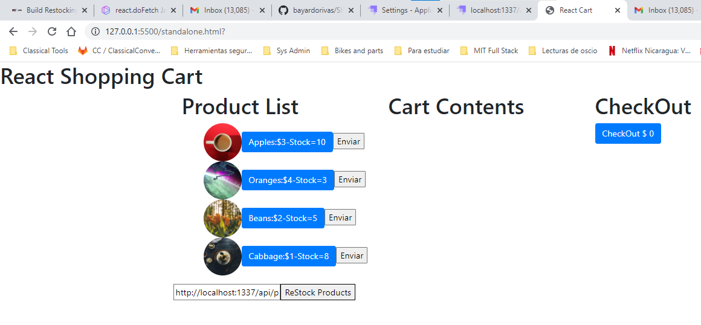

<div align="center" id="top"> 
  

  &#xa0;

</div>

<h1 align="center">ShoppingCart-MIT - Project</h1>

<p align="center">
  

  

  

  

  <!--  -->

  <!--  -->

  <!--  -->
</p>

<!-- Status -->

<!-- <h4 align="center"> 
	🚧  Real Time Bus Tracker 🚀 Under construction...  🚧
</h4> 

<hr> -->

<p align="center">
  <a href="#dart-about">About</a> &#xa0; | &#xa0; 
  <a href="#sparkles-features">Features</a> &#xa0; | &#xa0;
  <a href="#rocket-technologies">Technologies</a> &#xa0; | &#xa0;
  <a href="#white_check_mark-requirements">Requirements</a> &#xa0; | &#xa0;
  <a href="#checkered_flag-starting">Starting</a> &#xa0; | &#xa0;
  <a href="#memo-license">License</a> &#xa0; | &#xa0;
  <a href="#recycle-improvements">Improvements</a> &#xa0; | &#xa0;	
  <a href="https://github.com/bayardorivas" target="_blank">Author</a>
</p>

<br>

## :dart: About ##

ShoppingCart-MIT is a project with different levels of complexity. Working with React and hitting an Strapi API (STRAPI VERSION
v4.3.4). It's a nice project to learn a lot. I commented some code to remember some errors.

## :sparkles: Features ##

:heavy_check_mark: ShoppingCart-MIT include use of React, states, custom hook, fectching data hiting API created with Strapi.

## :rocket: Technologies ##

The following tools were used in this project:

- React JSX (useState, useEffect, useReducer)
- HTML
- CSS
- [Babel](https://babeljs.io/)
- STRAPI Version v4.3.4

## :white_check_mark: Requirements ##

Before starting : you need to have [Git](https://git-scm.com) and [Node](https://nodejs.org/en/) installed to clone de the project, and run a local web server (you can user Live Server of Visual Studio Code).

## :checkered_flag: Starting ##

```bash
# Clone this project
$ git clone https://github.com/bayardorivas/ShoppingCart-MIT

# Access
$ cd ShoppingCart-MIT

# Just Open the index.html file on your browser
```
## :recycle: Improvements ##

It would be nice the next improvements:
- [ ] Add an interface to load products using POST.

## :memo: License ##

This project is under license from MIT. For more details, see the [LICENSE](LICENSE.md) file.

Made with :heart: by <a href="https://github.com/bayardorivas" target="_blank">Bayardo Rivas</a>

&#xa0;

<a href="#top">Back to top</a>
